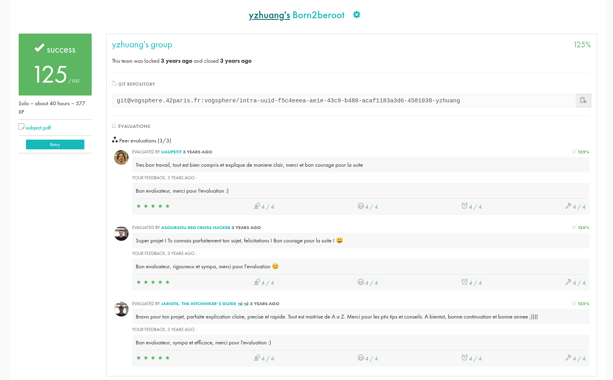

# ⚙️ Born2beroot

**A system administration project from 42 School**

## 🌐 Overview

Born2beroot focuses on installing and configuring a secure Linux server.  
The work includes LVM partitioning, user and sudo management, firewall and SSH hardening, and a monitoring script executed via cron.  
This repository contains a screenshot of my project page as proof of completion.

  

